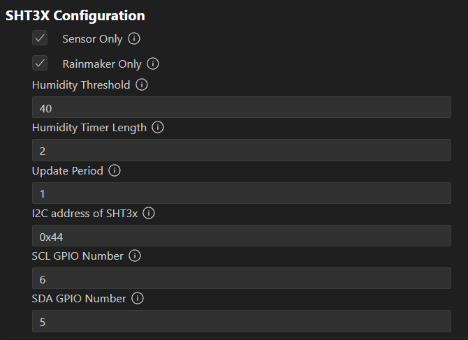

# Configuring Project

## SDK Configuration Editor Menu

The configuration menu for the SHT3x sensor allows the user to change certain parameters when needed for debugging or preference. The parameters are:

* `TEST_SENSOR` - Turn on to test if sensor code is working.
* `TEST_RAINMAKER` - Turn on to test if the Rainmaker code is working.
* `HUMID_THRESHOLD` - The minimum humidity (in %RH) where the drybox is considered too humid, causing the app to alert the user.
* `HUMID_TIMER_LENGTH` - The length of time (in minutes) for the drybox to be humid, before the app sends a notification to the user to replace the Silica Gel.
* `UPDATE_PERIOD` - The time interval (in minutes) that the ESP32 will send the humidity and temperature data to the Rainmaker Cloud.
* `SHT3X_ADDR` - I2C address of SHT3x, either 0x44 or 0x45. When ADDR pin is grounded, choose 0x44. When ADDR pin is pulled up to VDD, choose 0x45.
* `I2C_MASTER_SCL` - GPIO number for I2C Master clock line.
* `I2C_MASTER_SDA` - GPIO number for I2C Master data line.