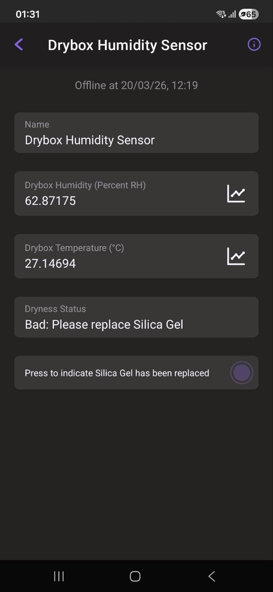

# Getting Started

## Install VSCode, ESP-IDF and Dependencies

The project firmware is an ESP-IDF project that requires the framework to compile and upload the code to the ESP32C6. To get started with ESP-IDF, click [here](https://docs.espressif.com/projects/esp-idf/en/stable/esp32/get-started/index.html).

The dependencies for this project are the following components that need to be installed:
* [ESP RainMaker Agent Component](https://components.espressif.com/components/espressif/esp_rainmaker/versions/1.12.1/readme)
* [RainMaker App Network Component](https://components.espressif.com/components/espressif/rmaker_app_network/versions/1.4.0/readme)
* [RainMaker App Insights Component](https://components.espressif.com/components/espressif/rmaker_app_insights/versions/1.0.0/readme)
* [esp-idf-lib/sht3x](https://components.espressif.com/components/esp-idf-lib/sht3x/versions/1.0.8/readme)

These can be installed via the ESP-IDF component registry on VSCode. 

## Uploading Firmware

Download this GitHub project (ZIP Code or git clone). Select ESP32C6 as the target board and build the project. Connect a USB cable from your computer to the ESP32C6 and flash the compiled code. 

## App Setup

With the USB still connected, open the serial monitor and scan the displayed QR code with the ESP Rainmaker App. Connect the ESP32C6 to your preferred WiFi. Once that is done, the App should display the below image. 

