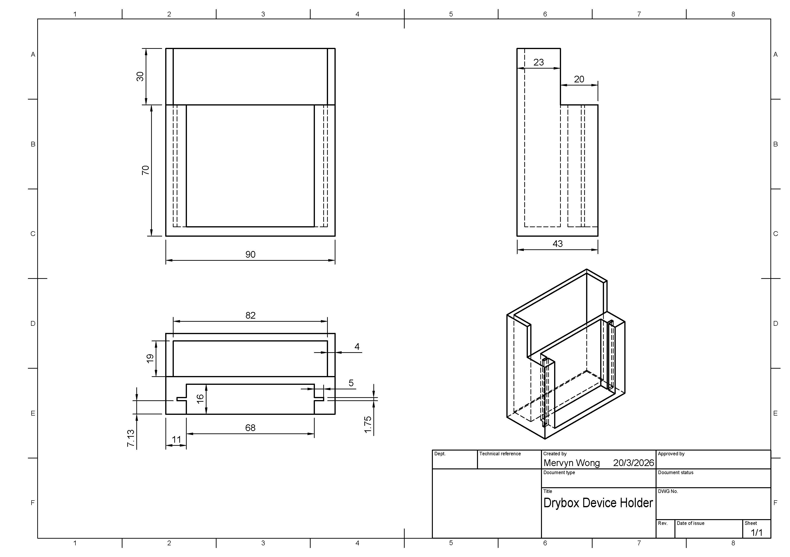
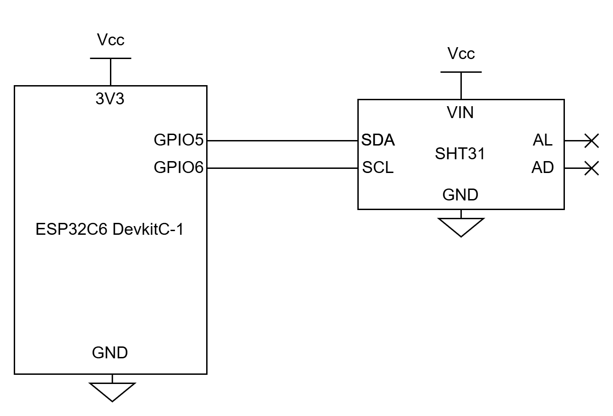

# Hardware

## Device Holder

The above dimension drawing shows the shape of the holder that will contain the circuitry. It is a Fusion 360 CAD file that can be ported to other CAD software such as SolidWorks. The holder can be 3D printed from the base up, though its fabrication is up to the user to decide. The front slot is for holding the electronics board of the device, while the back is to place a portable charger to power the ESp32C6 via its USB-C ports. 

## Electronics

The circuit only comprises of the ESP32C6 and the SHT31 sensor. The devices are connected via an I2C bus, with GPIO pins 5 and 6 acting as SDA and SCL respectively. The circuit board needs to conform to the dimensions of the device holder. 

## Full Assembly

The full assembly is shown above. 